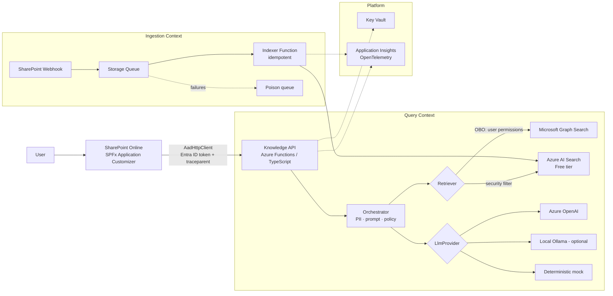
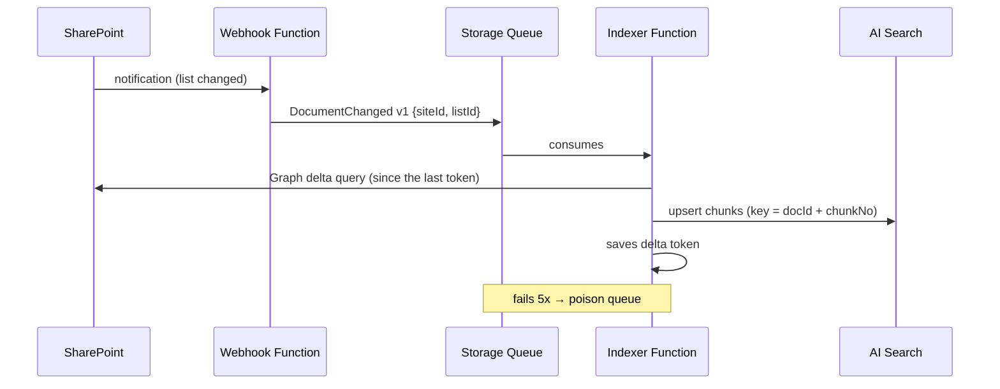

# Context-Aware Enterprise Knowledge Platform — Project Plan

> Corporate knowledge assistant embedded in SharePoint, with cited answers,
> respect for user permissions, governed AI and infrastructure as code.
> Portfolio project, zero cost, running on a real tenant (partner company).

---

## 1. Product vision

**Problem.** In companies that use SharePoint, knowledge is scattered across sites, libraries and
document versions. Finding the right policy, procedure or contract takes time, and native search
returns files, not answers.

**Solution.** A floating assistant present on every SharePoint page that:

1. understands the context of the page the user is on;
2. searches only documents that **that user** already has permission to open;
3. answers in natural language **always citing sources** (document, excerpt and link);
4. logs every interaction end-to-end for audit and observability.

**Non-goals (stated on purpose).**

- Does not replace Microsoft 365 Copilot. It shows _how_ to build a controlled solution when license,
  governance or model choice do not allow using Copilot (see ADR-001).
- Does not write or modify documents, read-only.
- Not multi-tenant, not a commercial product.

**Project success metrics**

| Metric                                 | Target                      |
| -------------------------------------- | --------------------------- |
| Answers with at least 1 valid citation | ≥ 90% on the evaluation set |
| Retrieval hit rate@5                   | ≥ 80% on the evaluation set |
| Leak of a document without permission  | 0 (automated test)          |
| End-to-end p95 latency                 | < 8 s                       |
| Monthly infrastructure cost            | R$ 0 (free tiers)           |

---

## 2. Certifications and books: what proves what

Rule: only what has **verifiable evidence in the repository** goes here. Everything else goes to the roadmap.

| Certification / book                      | Concrete evidence                                                                                                                                                                |
| ----------------------------------------- | -------------------------------------------------------------------------------------------------------------------------------------------------------------------------------- |
| **AZ-104**                                | Entra ID (app registrations, scopes, admin consent), least-privilege RBAC, Managed Identity, Key Vault, Storage, Application Insights and alerts, all provisioned and documented |
| **AZ-305**                                | Architecture document, ADRs with alternatives and trade-offs, identity and security design, review against the 5 Well-Architected pillars                                        |
| **Azure AI Engineer**                     | RAG pipeline, Azure AI Search with vectors, versioned prompt, PII filter, defense against prompt injection, evaluation set with metrics                                          |
| **Terraform Associate**                   | Reusable modules, remote state, `plan` on PR and `apply` with approval, `tflint`/`checkov` in CI                                                                                 |
| **CKA** _(Could)_                         | Containerized orchestrator, Helm chart, deploy to a `kind` cluster with probes, limits and NetworkPolicy, smoke test in CI                                                       |
| **TOGAF / Open Agile Architecture**       | Lean Architecture Vision, architecture principles, stakeholder map, ADRs as a living decision record                                                                             |
| **Domain-Driven Design**                  | Explicit bounded contexts (Query, Ingestion, Governance), ubiquitous language in a glossary, boundaries reflected in code                                                        |
| **Designing Data-Intensive Applications** | Idempotent ingestion, full reindexing, documented eventual consistency between SharePoint and the index                                                                          |
| **Building Event-Driven Microservices**   | Event-driven ingestion (webhook → queue → indexer), versioned event contracts, dead-letter queue                                                                                 |

**Out of scope (roadmap only):** AWS SA Pro, AWS DevOps Pro, Databricks, Google ML Engineer.

---

## 3. Architecture

### 3.1 Container view (C4 level 2)



### 3.2 Flow of a question

1. The SPFx captures the question and the **page context** (URL, title, site, library).
2. It calls the Knowledge API via `AadHttpClient`. The token is issued for the scope `api://knowledge-api/user_impersonation`
   and the request carries the W3C `traceparent` header.
3. The API validates the JWT (issuer, audience, tenant) and exchanges the token via **On-Behalf-Of** for a Graph token.
4. The Orchestrator applies the **PII filter** to the question and picks the prompt by its configured version.
5. The Retriever fetches candidates:
   - **GraphSearchRetriever** (Must): Graph Search with the user's token, so permission filtering is native;
   - **AiSearchRetriever** (Should): hybrid search (text + vector) filtered by the user's groups.
6. The excerpts go into the prompt **delimited and marked as untrusted data** (defense against indirect prompt injection).
7. The LlmProvider generates the answer in a structured format: `answer`, `citations[]`, `retrievalScores[]`.
8. The API validates that every citation points to an excerpt that was actually retrieved. A fabricated citation is discarded.
9. The answer returns to the SPFx with links to the sources. The full trace lives in Application Insights.

### 3.3 Bounded contexts (DDD)

| Context        | Responsibility                                    | Language                                  |
| -------------- | ------------------------------------------------- | ----------------------------------------- |
| **Query**      | Receive questions, retrieve, generate and cite    | Question, Excerpt, Citation, Answer       |
| **Ingestion**  | Reflect SharePoint changes in the index           | Document, Chunk, Change event, Reindexing |
| **Governance** | Policies, PII, prompt versions, audit, evaluation | Policy, Prompt version, Evaluation run    |

---

## 4. Architecture decisions (ADRs)

| ADR | Decision                                                                                                                                                                                                                                                                                                                  | Alternatives considered                                                 |
| --- | ------------------------------------------------------------------------------------------------------------------------------------------------------------------------------------------------------------------------------------------------------------------------------------------------------------------------- | ----------------------------------------------------------------------- |
| 001 | Custom solution instead of Microsoft 365 Copilot                                                                                                                                                                                                                                                                          | Copilot, Copilot Studio                                                 |
| 002 | SPFx Application Customizer with `Bottom` placeholder                                                                                                                                                                                                                                                                     | Web part on every page, iframe, direct DOM injection                    |
| 003 | `AadHttpClient` + API protected by Entra ID                                                                                                                                                                                                                                                                               | Manual MSAL, API key, anonymous function                                |
| 004 | Permission filtering via Graph Search (OBO) in the MVP                                                                                                                                                                                                                                                                    | Custom index with ACLs, no filtering                                    |
| 005 | `LlmProvider` and `Retriever` abstractions                                                                                                                                                                                                                                                                                | Coupling directly to one provider                                       |
| 006 | Azure OpenAI (Global Standard, managed identity) as primary provider; mock for tests                                                                                                                                                                                                                                      | GitHub Models (rate limits, prototype terms), Ollama                    |
| 007 | Zero secrets: Managed Identity as federated credential and OIDC in GitHub Actions. The OBO exchange itself proves the API's identity with a Key Vault-signed certificate client assertion, since a managed identity cannot be a federated credential for an app registration in another tenant (Phase 2 spec D1, ADR-011) | Client secret in Key Vault, secrets in GitHub                           |
| 008 | Event-driven ingestion with a queue and idempotent indexer                                                                                                                                                                                                                                                                | Scheduled crawler, AI Search's native indexer                           |
| 009 | OpenTelemetry + W3C `traceparent`                                                                                                                                                                                                                                                                                         | Custom correlation ID                                                   |
| 010 | Terraform with remote state in Azure Storage                                                                                                                                                                                                                                                                              | Bicep, ClickOps                                                         |
| 011 | Microsoft 365 and Azure in separate tenants (identity in the company, resources in a personal subscription)                                                                                                                                                                                                               | Subscription in the company's tenant, everything in the personal tenant |

Format: context → decision → alternatives → consequences → how to revert.

---

## 5. Security and compliance

- **Identity.** One app registration for the Knowledge API, exposing the `user_impersonation` scope.
  The SPFx has no app registration of its own: `AadHttpClient` uses the tenant's SharePoint
  extensibility principal, authorized on the "API access" page of the SharePoint Admin Center.
  App-only ingestion (Phase 7) will have a second app registration with `Sites.Selected`.
- **Least privilege.**
  - _Runtime (delegated):_ only what's needed for Graph Search. The user never sees more than they already see in SharePoint.
  - _Ingestion (app-only):_ `Sites.Selected`, granted only on the demo sites.
- **Secrets.** None in code, in GitHub, or in app settings. Managed Identity for Azure,
  federated credential for OBO and OIDC for CI/CD.
- **Prompt injection.** Retrieved content is delimited. The system prompt forbids following instructions coming from documents.
  There are tests with "malicious" documents in the evaluation set.
- **PII.** Detection of CPF, CNPJ, email and phone number (regex) before calling the LLM and before writing logs.
  Azure AI Language PII (F0 tier) is optional.
- **Logs.** No full question or answer in logs by default, only metadata and hashes. Content
  is only logged with an explicit demo-environment flag.
- **LGPD and partner company.** Written authorization, real data never leaves the tenant, the
  public repository uses only synthetic documents, and screenshots and video are anonymized.
- **No-leak test.** Two test users with different permissions. An automated test guarantees
  that user B never receives a citation from a document only A can access.

---

## 6. AI layer

### 6.1 Retrieval

- Chunking by section/title with overlap. Metadata: `docId`, `url`, `title`, `section`, `modifiedAt`, `aclGroups`.
- Hybrid search (BM25 + vector) in AI Search. Embeddings via GitHub Models or a local model.
- Configurable top-k, with deduplication by document.

### 6.2 Generation

- Prompts versioned under `/prompts/v{n}.md`, with the active version set by configuration and recorded on every trace.
- JSON output validated against a schema (zod). An out-of-schema answer triggers a retry and, if it fails again, a controlled error.
- With no relevant excerpts, the answer is "I couldn't find that in the documents available to you." No fabricated answers.

### 6.3 Evaluation (the project's differentiator)

- `eval/golden-set.json`: 30 questions with the expected document and expected facts, including:
  unanswerable questions, questions with PII, documents with prompt injection and permission-dependent questions.
- Metrics: hit rate@k, MRR, citation precision, correct-refusal rate and groundedness (LLM-as-judge).
- `npm run eval` generates `eval/reports/<date>.md`. In CI it runs with the mock provider to avoid structural regressions.
- Results comparing `prompt v1` with `v2` go in the README.

---

## 7. Data ingestion (event-driven)



- **Idempotency:** deterministic key per chunk. Reprocessing the same event does not create a duplicate.
- **Eventual consistency:** acceptable delay documented. Deletions are handled via delta query.
- **Full reindexing:** `npm run reindex` command to rebuild the index from scratch (DDIA: derived data).
- **Event contract:** schema versioned under `/contracts/events/document-changed.v1.json`.
- **Webhook renewal:** subscriptions expire, so a scheduled Function renews them before expiry.

---

## 8. Infrastructure and delivery

- **Terraform** (`azurerm` + `azuread`), with modules: `identity`, `function-app`, `search`, `observability`, `keyvault`.
  Remote state in a Storage Account with a lock.
- **GitHub Actions:**
  - `ci.yml`: lint, typecheck, unit tests, eval with mock, `.sppkg` build, `terraform fmt/validate`, `tflint`, `checkov`.
  - `infra.yml`: `terraform plan` commented on the PR and `apply` on `main` with a protected environment.
  - `deploy.yml`: deploy of the Functions and publishing of the `.sppkg` as a release artifact.
- **CI authentication:** OIDC (workload identity federation), no Azure secret in GitHub.
- **Kubernetes (Could):** Dockerfile for the orchestrator, Helm chart with probes, resources, HPA and NetworkPolicy,
  and a CI job that spins up a `kind` cluster and runs a smoke test.

---

## 9. Observability

- OpenTelemetry (`@azure/monitor-opentelemetry`) in the API and the indexer.
- The `traceparent` originates in the SPFx and travels API → Graph/Search → LLM, visible as a single trace.
- Custom metrics: `retrieval.latency`, `llm.latency`, `llm.tokens`, `answer.citations.count`, `answer.refused`.
- Application Insights workbook with volume, p50/p95 latency, refusal rate and errors by dependency.
- One alert: error rate > 5% over 15 min.
- A simple "Trace Viewer" page (or documented KQL query) to demonstrate the path of a question.

---

## 10. Repository structure

```
/
├── README.md                  # product: problem, demo, architecture, results
├── apps/
│   ├── spfx-assistant/        # Application Customizer (React + Fluent UI)
│   ├── knowledge-api/         # Azure Functions: /ask, auth, OBO, orchestrator
│   └── indexer/               # Functions: webhook, queue consumer, renewal
├── packages/
│   ├── core/                  # domain: Question, Chunk, Citation, policies
│   ├── retrievers/            # GraphSearchRetriever, AiSearchRetriever
│   └── llm-providers/         # github-models, ollama, mock
├── prompts/                   # v1.md, v2.md
├── contracts/events/          # versioned schemas
├── eval/                      # golden-set.json, runner, reports/
├── infra/terraform/           # modules + envs/dev
├── deploy/helm/               # (Could)
├── samples/documents/         # synthetic documents for the fictional company
├── docs/
│   ├── architecture.md        # vision, C4, flows, Well-Architected review
│   ├── adr/                   # 001..010
│   ├── security.md            # threat model (STRIDE summary)
│   ├── glossary.md            # ubiquitous language
│   ├── runbook.md             # deploy, renew webhook, reindex, rotation
│   └── certifications.md      # table from section 2 with links to code
└── .github/workflows/
```

---

## 11. Execution phases

Each phase ends with a **verifiable definition of done**. Priorities follow MoSCoW.
Goal: all **Must** items done within 7 days. Should and Could come later, with no deadline.

### Phase 0 — Foundation · Must · ~0.5 day

- Repository, monorepo (npm workspaces), lint, formatter, `.editorconfig`.
- Remote state and budget alert (`infra/terraform/bootstrap`).
- Knowledge API app registration and test groups via Terraform (`infra/terraform/modules/identity`).
- Test users A and B, demo site with synthetic documents and per-library permissions.
- Written authorization from the partner company.

**Done when:** `npm install && npm test` passes locally and the demo site exists with distinct permissions for A and B.

### Phase 1 — End-to-end skeleton · Must · ~1.5 days

- SPFx: floating button on the `Bottom` placeholder, accessible chat panel (keyboard, ARIA), page context.
- Knowledge API `/ask` with JWT validation and a mock `LlmProvider`.
- Call via `AadHttpClient` with permission approved in the Admin Center.

**Done when:** on real SharePoint, the user asks a question and receives an authenticated mock answer. Without a token, the API returns 401.

### Phase 2 — Retrieval with permissions and a real LLM · Must · ~1.5 days

- OBO flow and `GraphSearchRetriever`.
- Azure OpenAI `LlmProvider`, with prompt v1 and validated JSON output.
- Citations validated against the retrieved excerpts. Refusal when there is no context.

**Done when:** A and B ask the same question and get different, correct citations, and the no-leak test passes. When retrieval surfaces only content Azure OpenAI's content filter rejects, the API returns a safe refusal instead of an error.

### Phase 3 — Governance and quality · Must · ~1 day

- PII filter on input and logs.
- Defense against prompt injection and a malicious test document.
- Golden set (30 questions), evaluation runner and first report.
- OpenTelemetry + end-to-end `traceparent`.

**Done when:** `npm run eval` generates the report with metrics and a single trace appears in App Insights, from the SPFx to the LLM.

**Result (2026-09-18):** done. First report: all hard gates pass and every quality target is met (see `eval/reports/`). The golden set found a masking gap (CPF before a period), fixed before the first real run. Runbook: `docs/setup/phase-3.md`.

### Phase 4 — Infrastructure and CI/CD · Must · ~1 day

- Terraform for all of the Azure infra with remote state.
- `ci`, `infra` and `deploy` workflows with OIDC.
- Workbook and alert.

**Done when:** a destroyed environment is recreated with just `terraform apply` + pipeline, and the PR shows the commented `plan`.

**Result (2026-09-19):** done. The Azure root was destroyed and recreated by the approved `infra` workflow. One local `terraform apply` re-registered the OBO certificate in the partner tenant, and `deploy` republished the API. E2E 4/4 and the evaluation passed with the same SharePoint package. CI signs in with OIDC. It never touches the partner tenant, and plan comments carry no values. Runbook: `docs/setup/phase-4.md`.

### Phase 5 — Documentation and demo · Must · ~1 day

- Product README, `architecture.md` with C4, ADRs 001–010, `security.md`, `runbook.md`, `certifications.md`.
- 2-minute video and GIF at the top of the README.

**Done when:** an outsider understands the problem, architecture and result from the README alone in under 5 minutes.

**Result (2026-09-22):** documentation complete. Deviation: the video and GIF are recorded by the
owner and published only after a frame-by-frame anonymity review, because every live frame shows the
partner tenant. The README, architecture, security model, operational
runbook, certification evidence and ADRs are public and linked to implementation evidence. The
two-minute recording remains an operator-managed publication step: it must be captured from synthetic
examples and pass the frame-by-frame anonymity checklist in `docs/setup/phase-5.md` before any link or
GIF is added to the repository.

_Buffer: ~0.5 day._

### Phase 6 — Custom semantic search · Should · done

- Azure AI Search Free, chunking, embeddings, `AiSearchRetriever` with a security filter by groups.
- Evaluation comparing Graph Search and AI Search, published in the README.
- Prompt v2 with metric comparison.

Both retrievers passed every hard gate. Hybrid retrieval ranked marginally better and prompt v2
changed nothing at all, so `graph` and `v1` remain the defaults and `aisearch` stays selectable until
ingestion is event-driven. See the [Phase 6 runbook](setup/phase-6.md), [ADR-012](adr/012-hybrid-ai-search-retriever.md)
and [ADR-013](adr/013-prompt-versioning.md).

### Phase 7 — Event-driven ingestion · Could · done

- Webhook, queue, idempotent indexer with delta query, poison queue, subscription renewal, `reindex`.

Built as designed and verified against the real tenant: an uploaded document reached the index with no
command run, and deleting it removed exactly its chunks on an incremental pass. One addition the design
did not foresee: two events for the same drive would have consumed each other's changes, so the
consumer holds a blob lease on the drive's cursor for the whole pass. Ingestion runs app-only under its own identity with `Sites.Selected` granted on one site
([ADR-014](adr/014-app-only-ingestion-identity.md)); see the [Phase 7 runbook](setup/phase-7.md).

### Phase 8 — Kubernetes · Could · intentionally skipped

Containerizing the orchestrator and deploying it to `kind` would demonstrate packaging, not a
capability this product lacks: the API already runs serverless with managed identity, and a Helm
chart in this repository would be scaffolding nobody operates. Dropped in favour of finishing
Phase 7, where the gap (manual indexing) is real.

---

## 12. Costs

| Resource                | Tier                             | Expected cost        |
| ----------------------- | -------------------------------- | -------------------- |
| SharePoint / Entra ID   | Partner company's tenant         | R$ 0                 |
| Azure Functions         | Consumption (monthly free grant) | R$ 0                 |
| Application Insights    | Free ingestion quota             | R$ 0                 |
| Azure AI Search         | Free                             | R$ 0                 |
| Storage (state, queues) | Standard LRS                     | cents                |
| Key Vault               | Standard                         | cents                |
| GitHub Models / Ollama  | Free with rate limit / local     | R$ 0                 |
| GitHub Actions          | Public repository                | R$ 0                 |
| Azure OpenAI            | Global Standard, pay per token   | cents for demo usage |

Controls: a single **USD 5 budget alert** on the subscription
(`infra/terraform/bootstrap`), and `project`/`owner` tags on every resource.
`docs/architecture.md` includes the cost estimate with Azure OpenAI at real volume (e.g., 500 users).

---

## 13. Risks

| Risk                                             | Impact                 | Mitigation                                                                        |
| ------------------------------------------------ | ---------------------- | --------------------------------------------------------------------------------- |
| Company admin does not approve permissions       | Blocks Phases 1–2      | Request approval in Phase 0; plan B with a developer tenant, if eligible          |
| GitHub Models rate limit during the demo         | Demo fails             | Automatic fallback to Ollama/mock and video recorded in advance                   |
| Graph Search returns excerpts that are too short | Weak answers           | Fetch file content for the top-k; hybrid retrieval (Phase 6) serves stored chunks |
| Free tier limits of AI Search                    | Index does not fit     | Small, documented synthetic corpus                                                |
| Changes in the SPFx toolchain                    | Build breaks           | Pin SPFx and Node versions in `.nvmrc` and document them                          |
| Exposure of company data                         | Legal and reputational | Only synthetic documents in the repo, anonymized screenshots, no content in logs  |

---

## 14. Video script (2 min)

1. **0:00–0:15** The problem, in one sentence and one screen.
2. **0:15–0:50** User A opens the assistant in SharePoint, asks a question and gets an answer with clickable citations.
3. **0:50–1:10** User B asks the same question and does not receive the restricted document (**the key moment**).
4. **1:10–1:30** Single trace in Application Insights and evaluation report.
5. **1:30–1:50** Architecture diagram, green pipeline and `terraform plan`.
6. **1:50–2:00** What's next (roadmap).

---

## 15. Future roadmap (outside this project)

- Migration to Azure OpenAI + APIM as an AI Gateway (rate limiting, per-team quotas).
- Private Endpoints and VNet Integration.
- Publishing to Teams and Copilot Studio as an additional channel.
- 👍/👎 feedback feeding the golden set.
- Multi-cloud variant (AWS Bedrock + Kendra) as a comparative study.
