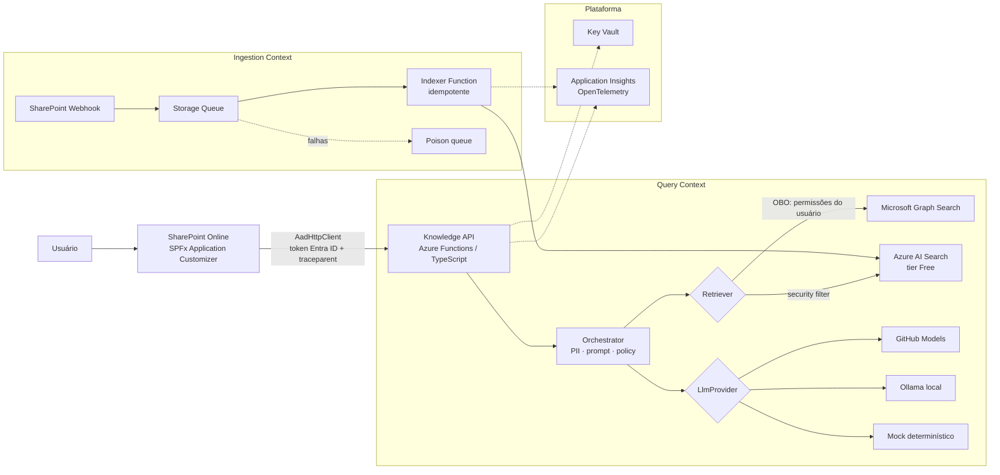
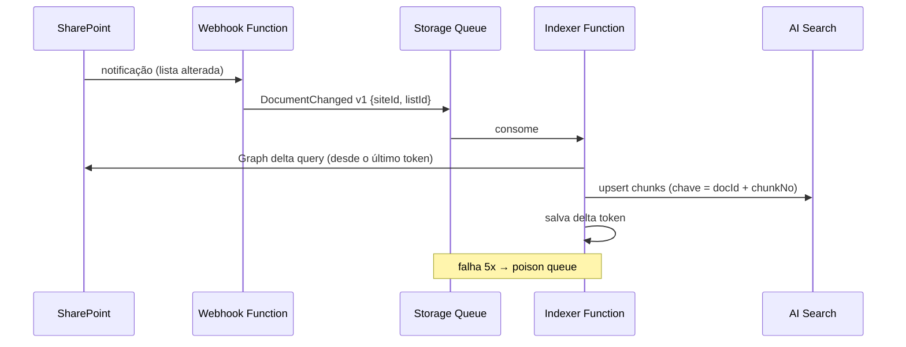

# Context-Aware Enterprise Knowledge Platform — Plano do Projeto

> Assistente de conhecimento corporativo embutido no SharePoint, com respostas citadas,
> respeito às permissões do usuário, IA governada e infraestrutura como código.
> Projeto de portfólio, custo zero, executado sobre um tenant real (empresa parceira).

---

## 1. Visão do produto

**Problema.** Em empresas que usam SharePoint, o conhecimento está espalhado entre sites, bibliotecas e
versões de documentos. Achar a política, o procedimento ou o contrato certo leva tempo, e a busca nativa
devolve arquivos, não respostas.

**Solução.** Um assistente flutuante presente em todas as páginas do SharePoint que:

1. entende o contexto da página em que o usuário está;
2. busca apenas em documentos que **aquele usuário** já tem permissão para abrir;
3. responde em linguagem natural **sempre citando as fontes** (documento, trecho e link);
4. registra cada interação de ponta a ponta para auditoria e observabilidade.

**Não-objetivos (declarados de propósito).**

- Não substitui o Microsoft 365 Copilot. Mostra _como_ construir uma solução controlada quando licença,
  governança ou escolha de modelo não permitem usar o Copilot (ver ADR-001).
- Não escreve nem altera documentos, só leitura.
- Não é multi-tenant nem produto comercial.

**Métricas de sucesso do projeto**

| Métrica                                   | Alvo                           |
| ----------------------------------------- | ------------------------------ |
| Respostas com pelo menos 1 citação válida | ≥ 90% no conjunto de avaliação |
| Hit rate@5 do retrieval                   | ≥ 80% no conjunto de avaliação |
| Vazamento de documento sem permissão      | 0 (teste automatizado)         |
| Latência p95 de ponta a ponta             | < 8 s                          |
| Custo mensal de infraestrutura            | R$ 0 (tiers gratuitos)         |

---

## 2. Certificações e livros: o que prova o quê

Regra: só entra aqui o que tem **evidência verificável no repositório**. O resto vai para o roadmap.

| Certificação / livro                      | Evidência concreta                                                                                                                                                                   |
| ----------------------------------------- | ------------------------------------------------------------------------------------------------------------------------------------------------------------------------------------ |
| **AZ-104**                                | Entra ID (app registrations, scopes, admin consent), RBAC de menor privilégio, Managed Identity, Key Vault, Storage, Application Insights e alertas, tudo provisionado e documentado |
| **AZ-305**                                | Documento de arquitetura, ADRs com alternativas e trade-offs, design de identidade e segurança, revisão com os 5 pilares do Well-Architected                                         |
| **Azure AI Engineer**                     | Pipeline RAG, Azure AI Search com vetores, prompt versionado, filtro de PII, defesa contra prompt injection, conjunto de avaliação com métricas                                      |
| **Terraform Associate**                   | Módulos reutilizáveis, state remoto, `plan` em PR e `apply` com aprovação, `tflint`/`checkov` no CI                                                                                  |
| **CKA** _(Could)_                         | Orquestrador em container, Helm chart, deploy em cluster `kind` com probes, limits e NetworkPolicy, smoke test no CI                                                                 |
| **TOGAF / Open Agile Architecture**       | Architecture Vision enxuta, princípios de arquitetura, mapa de stakeholders, ADRs como registro vivo de decisões                                                                     |
| **Domain-Driven Design**                  | Bounded contexts explícitos (Query, Ingestion, Governance), linguagem ubíqua em glossário, fronteiras refletidas no código                                                           |
| **Designing Data-Intensive Applications** | Ingestão idempotente, reindexação completa, consistência eventual entre SharePoint e índice documentada                                                                              |
| **Building Event-Driven Microservices**   | Ingestão por eventos (webhook → fila → indexador), contratos de evento versionados, dead-letter queue                                                                                |

**Fora do escopo (entram só no roadmap):** AWS SA Pro, AWS DevOps Pro, Databricks, Google ML Engineer.

---

## 3. Arquitetura

### 3.1 Visão de containers (C4 nível 2)



### 3.2 Fluxo de uma pergunta

1. O SPFx captura a pergunta e o **contexto da página** (URL, título, site, biblioteca).
2. Chama a Knowledge API com `AadHttpClient`. O token é emitido para o scope `api://knowledge-api/user_impersonation`
   e a requisição carrega o header W3C `traceparent`.
3. A API valida o JWT (issuer, audience, tenant) e troca o token via **On-Behalf-Of** por um token do Graph.
4. O Orchestrator aplica o **filtro de PII** na pergunta e escolhe o prompt pela versão configurada.
5. O Retriever busca candidatos:
   - **GraphSearchRetriever** (Must): Graph Search com o token do usuário, então a filtragem por permissão é nativa;
   - **AiSearchRetriever** (Should): busca híbrida (texto + vetor) com filtro pelos grupos do usuário.
6. Os trechos entram no prompt **delimitados e marcados como dados não confiáveis** (defesa contra prompt injection indireta).
7. O LlmProvider gera a resposta em formato estruturado: `answer`, `citations[]`, `retrievalScores[]`.
8. A API valida que toda citação aponta para um trecho realmente recuperado. Citação inventada é descartada.
9. A resposta volta ao SPFx com links para as fontes. O trace completo fica no Application Insights.

### 3.3 Bounded contexts (DDD)

| Contexto       | Responsabilidade                                        | Linguagem                                         |
| -------------- | ------------------------------------------------------- | ------------------------------------------------- |
| **Query**      | Receber perguntas, recuperar, gerar e citar             | Pergunta, Trecho, Citação, Resposta               |
| **Ingestion**  | Refletir mudanças do SharePoint no índice               | Documento, Chunk, Evento de mudança, Reindexação  |
| **Governance** | Políticas, PII, versões de prompt, auditoria, avaliação | Política, Versão de prompt, Execução de avaliação |

---

## 4. Decisões de arquitetura (ADRs)

| ADR | Decisão                                                                                              | Alternativas consideradas                                      |
| --- | ---------------------------------------------------------------------------------------------------- | -------------------------------------------------------------- |
| 001 | Solução própria em vez do Microsoft 365 Copilot                                                      | Copilot, Copilot Studio                                        |
| 002 | SPFx Application Customizer com placeholder `Bottom`                                                 | Web part em cada página, iframe, injeção direta no DOM         |
| 003 | `AadHttpClient` + API protegida pelo Entra ID                                                        | MSAL manual, chave de API, função anônima                      |
| 004 | Filtragem por permissão via Graph Search (OBO) no MVP                                                | Índice próprio com ACL, sem filtragem                          |
| 005 | Abstrações `LlmProvider` e `Retriever`                                                               | Acoplar direto a um fornecedor                                 |
| 006 | GitHub Models/Ollama no MVP, Azure OpenAI documentado como destino                                   | Azure OpenAI desde o início (custo), só mock (sem valor de IA) |
| 007 | Zero segredos: Managed Identity como federated credential e OIDC no GitHub Actions                   | Client secret no Key Vault, secrets no GitHub                  |
| 008 | Ingestão event-driven com fila e indexador idempotente                                               | Crawler agendado, indexer nativo do AI Search                  |
| 009 | OpenTelemetry + `traceparent` W3C                                                                    | Correlation ID próprio                                         |
| 010 | Terraform com state remoto no Azure Storage                                                          | Bicep, ClickOps                                                |
| 011 | Microsoft 365 e Azure em tenants separados (identidade na empresa, recursos na subscription própria) | Subscription no tenant da empresa, tudo no tenant pessoal      |

Formato: contexto → decisão → alternativas → consequências → como reverter.

---

## 5. Segurança e compliance

- **Identidade.** Uma app registration para a Knowledge API, que expõe o scope `user_impersonation`.
  O SPFx não tem app registration própria: o `AadHttpClient` usa o principal de extensibilidade do
  SharePoint do tenant, autorizado na página "API access" do SharePoint Admin Center.
  A ingestão app-only (Fase 7) terá uma segunda app registration com `Sites.Selected`.
- **Menor privilégio.**
  - _Runtime (delegado):_ só o necessário para o Graph Search. O usuário nunca vê mais do que já vê no SharePoint.
  - _Ingestão (app-only):_ `Sites.Selected`, liberado apenas nos sites da demo.
- **Segredos.** Nenhum no código, nem no GitHub, nem em app settings. Managed Identity para Azure,
  federated credential para OBO e OIDC para CI/CD.
- **Prompt injection.** Conteúdo recuperado vai delimitado. O system prompt proíbe seguir instruções vindas dos documentos.
  Existem testes com documentos "maliciosos" no conjunto de avaliação.
- **PII.** Detecção de CPF, CNPJ, e-mail e telefone (regex) antes de chamar o LLM e antes de gravar logs.
  Azure AI Language PII (tier F0) é opcional.
- **Logs.** Nenhuma pergunta ou resposta completa em log por padrão, só metadados e hashes. O conteúdo
  só é gravado com uma flag explícita de ambiente de demo.
- **LGPD e empresa parceira.** Autorização por escrito, dados reais nunca saem do tenant, o repositório
  público usa apenas documentos sintéticos, e prints e vídeo são anonimizados.
- **Teste de não-vazamento.** Dois usuários de teste com permissões diferentes. Um teste automatizado garante
  que o usuário B nunca recebe citação de documento que só o A acessa.

---

## 6. Camada de IA

### 6.1 Retrieval

- Chunking por seção/título com sobreposição. Metadados: `docId`, `url`, `title`, `section`, `modifiedAt`, `aclGroups`.
- Busca híbrida (BM25 + vetor) no AI Search. Embeddings via GitHub Models ou modelo local.
- Top-k configurável, com deduplicação por documento.

### 6.2 Geração

- Prompts versionados em `/prompts/v{n}.md`, com versão ativa por configuração e registrada em cada trace.
- Saída JSON validada por schema (zod). Uma resposta fora do schema gera nova tentativa e, se falhar de novo, erro controlado.
- Sem trechos relevantes, a resposta é "não encontrei nos documentos disponíveis para você". Nada de resposta inventada.

### 6.3 Avaliação (o diferencial do projeto)

- `eval/golden-set.json`: 30 perguntas com documento esperado e fatos esperados, incluindo:
  perguntas sem resposta, perguntas com PII, documentos com prompt injection e perguntas dependentes de permissão.
- Métricas: hit rate@k, MRR, precisão de citação, taxa de recusa correta e groundedness (LLM-as-judge).
- `npm run eval` gera `eval/reports/<data>.md`. No CI roda com o provider mock para evitar regressão estrutural.
- Resultados comparando `prompt v1` com `v2` ficam no README.

---

## 7. Ingestão de dados (event-driven)



- **Idempotência:** chave determinística por chunk. Reprocessar o mesmo evento não gera duplicata.
- **Consistência eventual:** atraso aceitável documentado. Deleções são tratadas via delta query.
- **Reindexação completa:** comando `npm run reindex` para reconstruir o índice do zero (DDIA: derived data).
- **Contrato de evento:** schema versionado em `/contracts/events/document-changed.v1.json`.
- **Renovação de webhook:** as assinaturas expiram, então uma Function agendada renova antes do vencimento.

---

## 8. Infraestrutura e entrega

- **Terraform** (`azurerm` + `azuread`), com módulos: `identity`, `function-app`, `search`, `observability`, `keyvault`.
  State remoto em Storage Account com lock.
- **GitHub Actions:**
  - `ci.yml`: lint, typecheck, testes unitários, eval com mock, build do `.sppkg`, `terraform fmt/validate`, `tflint`, `checkov`.
  - `infra.yml`: `terraform plan` comentado no PR e `apply` na `main` com environment protegido.
  - `deploy.yml`: deploy das Functions e publicação do `.sppkg` como artefato do release.
- **Autenticação no CI:** OIDC (workload identity federation), sem secret de Azure no GitHub.
- **Kubernetes (Could):** Dockerfile do orquestrador, Helm chart com probes, resources, HPA e NetworkPolicy,
  e job no CI que sobe um cluster `kind` e roda um smoke test.

---

## 9. Observabilidade

- OpenTelemetry (`@azure/monitor-opentelemetry`) na API e no indexador.
- O `traceparent` nasce no SPFx e atravessa API → Graph/Search → LLM, ficando visível como um trace único.
- Métricas customizadas: `retrieval.latency`, `llm.latency`, `llm.tokens`, `answer.citations.count`, `answer.refused`.
- Workbook no Application Insights com volume, latência p50/p95, taxa de recusa e erros por dependência.
- Um alerta: taxa de erro > 5% em 15 min.
- Página "Trace Viewer" simples (ou query KQL documentada) para demonstrar o caminho de uma pergunta.

---

## 10. Estrutura do repositório

```
/
├── README.md                  # produto: problema, demo, arquitetura, resultados
├── apps/
│   ├── spfx-assistant/        # Application Customizer (React + Fluent UI)
│   ├── knowledge-api/         # Azure Functions: /ask, auth, OBO, orchestrator
│   └── indexer/               # Functions: webhook, queue consumer, renewal
├── packages/
│   ├── core/                  # domínio: Question, Chunk, Citation, políticas
│   ├── retrievers/            # GraphSearchRetriever, AiSearchRetriever
│   └── llm-providers/         # github-models, ollama, mock
├── prompts/                   # v1.md, v2.md
├── contracts/events/          # schemas versionados
├── eval/                      # golden-set.json, runner, reports/
├── infra/terraform/           # módulos + envs/dev
├── deploy/helm/               # (Could)
├── samples/documents/         # documentos sintéticos da empresa fictícia
├── docs/
│   ├── architecture.md        # visão, C4, fluxos, Well-Architected review
│   ├── adr/                   # 001..010
│   ├── security.md            # threat model (STRIDE resumido)
│   ├── glossary.md            # linguagem ubíqua
│   ├── runbook.md             # deploy, renovar webhook, reindexar, rotação
│   └── certifications.md      # tabela da seção 2 com links para o código
└── .github/workflows/
```

---

## 11. Fases de execução

Cada fase termina com um **critério de pronto verificável**. As prioridades seguem MoSCoW.
Meta: todo o **Must** pronto em 7 dias. Should e Could vêm depois, sem prazo.

### Fase 0 — Fundação · Must · ~0,5 dia

- Repositório, monorepo (npm workspaces), lint, formatter, `.editorconfig`.
- State remoto e alerta de orçamento (`infra/terraform/bootstrap`).
- App registration da Knowledge API e grupos de teste via Terraform (`infra/terraform/modules/identity`).
- Usuários de teste A e B, site de demo com documentos sintéticos e permissões por biblioteca.
- Autorização escrita da empresa parceira.

**Pronto quando:** `npm install && npm test` passa localmente e o site de demo existe com permissões distintas para A e B.

### Fase 1 — Esqueleto de ponta a ponta · Must · ~1,5 dia

- SPFx: botão flutuante no placeholder `Bottom`, painel de chat acessível (teclado, ARIA), contexto da página.
- Knowledge API `/ask` com validação de JWT e `LlmProvider` mock.
- Chamada via `AadHttpClient` com permissão aprovada no Admin Center.

**Pronto quando:** no SharePoint real, o usuário pergunta e recebe a resposta mock autenticada. Sem token, a API retorna 401.

### Fase 2 — Retrieval com permissões e LLM real · Must · ~1,5 dia

- Fluxo OBO e `GraphSearchRetriever`.
- `LlmProvider` GitHub Models, com prompt v1 e saída JSON validada.
- Citações validadas contra os trechos recuperados. Recusa quando não há contexto.

**Pronto quando:** A e B fazem a mesma pergunta e recebem citações diferentes e corretas, e o teste de não-vazamento passa.

### Fase 3 — Governança e qualidade · Must · ~1 dia

- Filtro de PII na entrada e nos logs.
- Defesa contra prompt injection e documento malicioso de teste.
- Golden set (30 perguntas), runner de avaliação e primeiro relatório.
- OpenTelemetry + `traceparent` de ponta a ponta.

**Pronto quando:** `npm run eval` gera o relatório com métricas e um trace único aparece no App Insights, do SPFx ao LLM.

### Fase 4 — Infraestrutura e CI/CD · Must · ~1 dia

- Terraform de toda a infra Azure com state remoto.
- Workflows `ci`, `infra` e `deploy` com OIDC.
- Workbook e alerta.

**Pronto quando:** um ambiente destruído é recriado só com `terraform apply` + pipeline, e o PR mostra o `plan` comentado.

### Fase 5 — Documentação e demo · Must · ~1 dia

- README-produto, `architecture.md` com C4, ADRs 001–010, `security.md`, `runbook.md`, `certifications.md`.
- Vídeo de 2 min e GIF no topo do README.

**Pronto quando:** uma pessoa de fora entende problema, arquitetura e resultado só pelo README em menos de 5 minutos.

_Buffer: ~0,5 dia._

### Fase 6 — Busca semântica própria · Should

- Azure AI Search Free, chunking, embeddings, `AiSearchRetriever` com security filter por grupos.
- Avaliação comparando Graph Search e AI Search, publicada no README.
- Prompt v2 com comparação de métricas.

### Fase 7 — Ingestão event-driven · Could

- Webhook, fila, indexador idempotente com delta query, poison queue, renovação de assinatura, `reindex`.

### Fase 8 — Kubernetes · Could

- Container do orquestrador, Helm chart, deploy em `kind`, smoke test no CI.

---

## 12. Custos

| Recurso                | Tier                             | Custo esperado |
| ---------------------- | -------------------------------- | -------------- |
| SharePoint / Entra ID  | Tenant da empresa parceira       | R$ 0           |
| Azure Functions        | Consumption (cota grátis mensal) | R$ 0           |
| Application Insights   | Cota grátis de ingestão          | R$ 0           |
| Azure AI Search        | Free                             | R$ 0           |
| Storage (state, filas) | Standard LRS                     | centavos       |
| Key Vault              | Standard                         | centavos       |
| GitHub Models / Ollama | Grátis com rate limit / local    | R$ 0           |
| GitHub Actions         | Repositório público              | R$ 0           |

Controles: **budget alert de R$ 10** na subscription e tags `project`/`owner` em todos os recursos.
`docs/architecture.md` inclui a estimativa de custo com Azure OpenAI em volume real (ex.: 500 usuários).

---

## 13. Riscos

| Risco                                      | Impacto              | Mitigação                                                                   |
| ------------------------------------------ | -------------------- | --------------------------------------------------------------------------- |
| Admin da empresa não aprova permissões     | Bloqueia Fases 1–2   | Pedir aprovação na Fase 0; plano B com tenant de desenvolvedor, se elegível |
| Rate limit do GitHub Models na demo        | Demo falha           | Fallback automático para Ollama/mock e vídeo gravado com antecedência       |
| Graph Search retorna trechos curtos demais | Respostas fracas     | Buscar conteúdo do arquivo para os top-k; Fase 6 resolve de vez             |
| Limites do tier Free do AI Search          | Índice não cabe      | Corpus sintético pequeno e documentado                                      |
| Mudanças no toolchain do SPFx              | Build quebra         | Fixar versão do SPFx e Node em `.nvmrc` e documentar                        |
| Exposição de dados da empresa              | Jurídico e reputação | Só documentos sintéticos no repo, prints anonimizados, logs sem conteúdo    |

---

## 14. Roteiro do vídeo (2 min)

1. **0:00–0:15** O problema, em uma frase e uma tela.
2. **0:15–0:50** Usuário A no SharePoint abre o assistente, faz uma pergunta e recebe resposta com citações clicáveis.
3. **0:50–1:10** Usuário B faz a mesma pergunta e não recebe o documento restrito (**o momento-chave**).
4. **1:10–1:30** Trace único no Application Insights e relatório de avaliação.
5. **1:30–1:50** Diagrama de arquitetura, pipeline verde e `terraform plan`.
6. **1:50–2:00** O que vem a seguir (roadmap).

---

## 15. Roadmap futuro (fora deste projeto)

- Migração para Azure OpenAI + APIM como AI Gateway (rate limit, quotas por equipe).
- Private Endpoints e VNet Integration.
- Publicação em Teams e Copilot Studio como canal adicional.
- Feedback 👍/👎 alimentando o golden set.
- Variante multi-cloud (AWS Bedrock + Kendra) como estudo comparativo.
