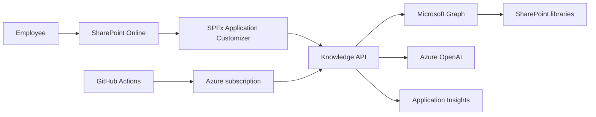
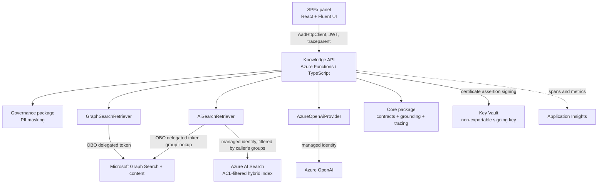
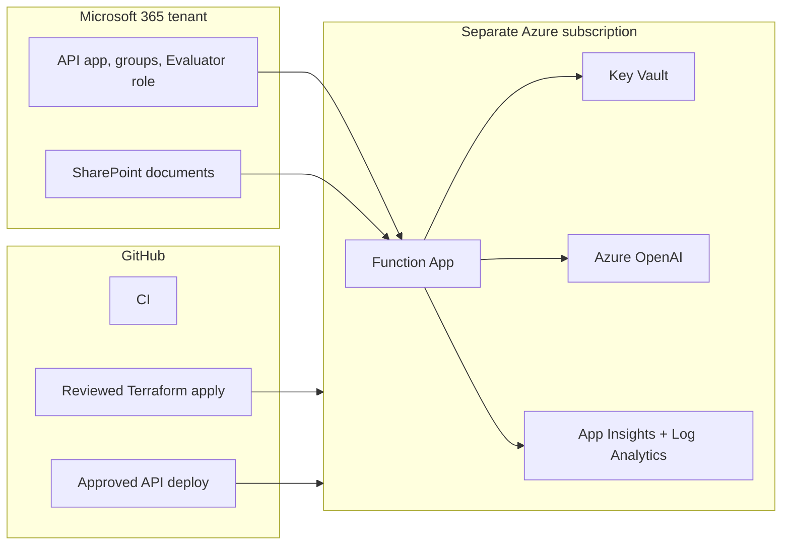

# Architecture

## Purpose and scope

The platform is a read-only knowledge assistant embedded in SharePoint. It turns documents that a
user can already open into cited answers. It is not a replacement for Microsoft 365 Copilot, a
document-authoring tool, a multi-tenant product or an enterprise-wide search platform.

The public repository contains code, Terraform and synthetic documents only. The deployed environment
connects to a separate Microsoft 365 tenant under written authorization; its identifiers are never
stored here.

## System context

| External system      | Responsibility                                                     | Trust boundary                            |
| -------------------- | ------------------------------------------------------------------ | ----------------------------------------- |
| SharePoint Online    | User interface, document storage and authorization source          | Microsoft 365 tenant                      |
| Microsoft Graph      | Delegated search and file download                                 | Delegated user access token               |
| Azure OpenAI         | Structured answer generation                                       | Azure subscription, managed identity      |
| GitHub Actions       | Verification, reviewed infrastructure plan and approved deployment | Public repository, OIDC workload identity |
| Application Insights | Content-free telemetry and traces                                  | Azure subscription                        |

## Containers

The monorepo keeps the boundaries explicit: `apps/knowledge-api` orchestrates requests,
`apps/spfx-assistant` hosts the UI, `packages/governance` masks input, `packages/retrievers` holds
both retrievers, `packages/llm-providers` calls the model, and `packages/core` owns shared contracts.
`tools/indexer` is an operator-run job, not part of the request path.

## Request flow

1. The SPFx panel creates a W3C `traceparent` and calls `POST /api/ask` through `AadHttpClient`.
2. The API validates issuer, audience, tenant and expiry in the Entra ID access token.
3. Input PII is masked before retrieval, model generation or logging.
4. The API exchanges the user token through OBO. Its client assertion is signed by a non-exportable
   Key Vault key.
5. Retrieval runs under the caller's identity, by whichever of the two paths the deployment (or an
   evaluator's `x-kb-retriever` header) selects. Graph Search runs with the delegated Graph token, so
   SharePoint permission trimming happens at the source, and only in-scope `.docx` candidates are
   downloaded. The hybrid path queries Azure AI Search with a filter built from the caller's own
   Entra group ids, read from `/me/memberOf` with that same delegated token; a caller with no groups
   gets no results and no query is issued. Both paths obey one context budget.
6. The provider sends a versioned prompt plus explicitly untrusted document delimiters to Azure OpenAI.
7. Structured output is schema-validated. Citation grounding permits only excerpts that actually
   appeared in retrieval. No evidence, ungrounded output or content-filtered context becomes a safe refusal.
8. The panel renders the answer, citations and PII notice; error messages carry the trace code. Evaluator diagnostics are
   returned only for the dedicated Entra app role.

## Tenant and delivery boundary

The Azure root and partner-identity root have separate Terraform state. GitHub OIDC receives access
to the Azure subscription only. Identity changes in the Microsoft 365 tenant are applied locally by
the operator. This prevents a public CI system from holding a credential for the partner tenant.

## Quality attributes

| Attribute       | Design response                                                                              | Evidence                                                                        |
| --------------- | -------------------------------------------------------------------------------------------- | ------------------------------------------------------------------------------- |
| Security        | Delegated Graph retrieval, OBO, Key Vault signing, managed identity and least-privilege RBAC | [security.md](security.md), [ADR-004](adr/004-obo-graph-permission-trimming.md) |
| Privacy         | PII masking before external calls and content-free logs                                      | `packages/governance`, [Phase 3 runbook](setup/phase-3.md)                      |
| Reliability     | Typed upstream errors, safe refusals, one retry for schema-invalid model output and alerting | [Phase 2 runbook](setup/phase-2.md), [Phase 4 runbook](setup/phase-4.md)        |
| Observability   | W3C trace context, named spans, metrics, workbook and error-rate alert                       | [ADR-009](adr/009-opentelemetry-and-w3c-tracing.md)                             |
| Maintainability | Strict TypeScript, tests, package boundaries, Terraform modules and ADRs                     | `npm run check`, [certifications.md](certifications.md)                         |
| Recoverability  | Remote state, reviewed pipeline and a tested destroy/recreate drill                          | [Phase 4 recovery drill](setup/phase-4.md#recovery-drill)                       |

## Cost and scale boundary

The development environment uses consumption-oriented services and a small Azure OpenAI deployment.
A subscription budget alert is configured as a guardrail; it is not a cost guarantee. The documented
evaluation corpus has eight synthetic documents and is deliberately small, which bounds what the
retriever comparison can show: with thirty chunks in the index, a hybrid query returns most of the
corpus whatever the question, so ranking differences are compressed and irrelevant chunks reach the
prompt more easily than they would at scale ([Phase 6 runbook](setup/phase-6.md)).

## Related decisions

The detailed reasoning lives in the [ADRs](adr/). The cross-tenant boundary is documented by
[ADR-007](adr/007-secretless-runtime-and-delivery.md) and the Phase 4 design.
