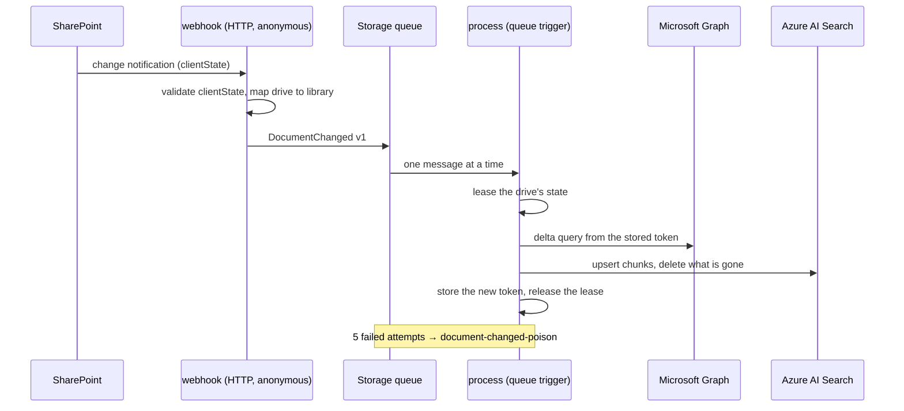

# Phase 7 — Event-driven ingestion: runbook

Definition of done: a change in a SharePoint library reaches the index without anyone running a
command, deletions included, and a message the service cannot apply ends up somewhere an operator can
look at instead of disappearing.

## Checklist

| #   | Item                                                                   | Where  | Status                     |
| --- | ---------------------------------------------------------------------- | ------ | -------------------------- |
| 1   | Versioned event contract (`contracts/events/document-changed.v1.json`) | Repo   | ✅                         |
| 2   | Idempotent application of changes, deletions included                  | Repo   | ✅                         |
| 3   | Delta query per drive with a stored, leased cursor                     | Repo   | ✅                         |
| 4   | Webhook, queue consumer and renewal timer as a separate Function App   | Repo   | ✅                         |
| 5   | `npm run reindex` rebuilds the index and resets the cursors            | Local  | ✅                         |
| 6   | App-only ingestion identity: `Sites.Selected`, certificate assertion   | Tenant | ⏳ applied by the operator |
| 7   | Queues, roles and Function App created; package deployed               | Azure  | ⏳ applied by the pipeline |
| 8   | A real edit in SharePoint reaches the index; a deletion removes it     | Tenant | ⏳ verify after 6 and 7    |

The repository is complete and the behaviour is covered by tests; rows 6 to 8 need the operator steps
below, and this document records their result once they are done.

## How it fits together



Three properties matter more than the diagram:

**The event carries no content.** It names a library, not a document. Everything indexed comes from a
delta query issued while processing, so a duplicated, replayed or out-of-order event cannot describe
stale content — it can only cause a re-read.

**Applying a change twice is the same as applying it once.** A chunk's key is derived from the
document id and the section index, so re-processing rewrites the same rows. Sections that disappeared
because a document got shorter are deleted by comparing the document's stored chunk ids with the ones
it has now, and that same comparison removes a deleted document. Deletion needs no separate path:
the delta query reports it like any other change.

**The cursor advances last.** The new delta token is stored only after the changes it described were
applied. A crash in between leaves the message to be retried from the same point; the alternative —
storing first — would skip exactly the changes the crash lost.

Two events for the same drive must not run at once, or each would consume changes the other believes
it still has to process. The consumer takes a blob lease on the drive's state for the whole pass, and
a second consumer of the same drive fails to take it and lets its message return to the queue.

## Authorization

Ingestion runs with no user present, so it cannot borrow the caller's permissions the way the API
does. Two things keep that from becoming "the indexer can read everything":

- The application permission is `Sites.Selected`, which grants **nothing** on its own. Access is
  granted per site, so this identity reads the demo site and no other content in the tenant.
- The identity is separate from the API's. It may write to the search index — the only identity in the
  system that may — and the API may only read. Neither can do the other's job.

It proves itself with a Key Vault certificate, like the API's On-Behalf-Of exchange, because a managed
identity in the subscription tenant cannot be a credential for an app registration in the partner
tenant (ADR-011). The private key is non-exportable; the service can only ask Key Vault to sign.

The webhook itself is anonymous, because Microsoft Graph cannot present an Entra token to it. The
subscription's `clientState` is what authenticates a notification: it is a 64-character random value
in Key Vault, compared without an early return, and a notification that fails the comparison is
dropped without the response saying why.

## Bringing it up

The certificate lives in the subscription tenant and the application registration in the partner
tenant, so the same three-step dance as Phase 4 applies:

1. `terraform -chdir=infra/terraform/envs/dev-identity apply` — creates the ingestion application and
   consents to `Sites.Selected`. The certificate does not exist yet, so its registration is **skipped**
   and listed in the `pending_certificate_registrations` output. The apply succeeds, which matters:
   a failed apply does not persist this root's outputs, and the next step reads them.
2. `terraform -chdir=infra/terraform/envs/dev apply` (through `infra.yml`) — creates the certificate,
   the Function App, the queues and the role assignments.
3. `terraform -chdir=infra/terraform/envs/dev-identity apply` again — registers the certificate, and
   `pending_certificate_registrations` comes back empty.

Then, once per site, grant the identity access to it. This is a Graph data-plane call, not something
Terraform models:

```bash
az rest --method POST \
  --url "https://graph.microsoft.com/v1.0/sites/<SITE_ID>/permissions" \
  --headers "Content-Type=application/json" \
  --body '{"roles":["read"],"grantedToIdentities":[{"application":{"id":"<INGESTION_CLIENT_ID>","displayName":"kb-ingestion-dev"}}]}'
```

`<SITE_ID>` comes from `GET /sites/<host>:/sites/<name>`, and `<INGESTION_CLIENT_ID>` from the
`ingestion_client_id` output of `envs/dev-identity`. The call needs `Sites.FullControl.All`; if the
Azure CLI token does not carry it, do the same request in Graph Explorer as a SharePoint administrator.

Finally:

- Update the `TF_VARS_DEV` repository secret with the new `ingestion_*` variables and the new
  `name_suffixes.ingestion`. A local `terraform.tfvars` change does not reach the pipeline.
- Add the `INGESTION_FUNCTION_APP_NAME` repository secret (the `ingestion_function_app_name` output)
  so `deploy-indexer.yml` knows where to publish.
- Approve the `dev` environment for `deploy-indexer`.

The subscriptions themselves need no manual step: the renewal timer creates whatever is missing. It
runs every six hours, so to start immediately, run the `renew` function once from the portal
(**Code + Test → Test/Run**) and check its log line for `created`.

## Operating it

| Question                              | Where to look                                                                     |
| ------------------------------------- | --------------------------------------------------------------------------------- |
| Did a change arrive?                  | `ingestion.notified` (accepted and rejected counts), then `ingestion.processed`   |
| What did it index?                    | `ingestion.processed`: documents indexed and removed, chunks uploaded and deleted |
| Are the subscriptions alive?          | `ingestion.subscriptions-reconciled` every six hours; `failures` must be 0        |
| Is something stuck?                   | the `document-changed-poison` queue; each message is a full event, safe to read   |
| Did the index and the corpus diverge? | `npm run reindex`, which rebuilds from SharePoint and reports what it deleted     |

A lapsed subscription is a freshness problem, not a correctness one: the renewal run recreates it and
the next delta query reports everything that changed while it was gone. A poisoned message is the
opposite — it means the service refused to guess, so read it before deleting it.

`npm run reindex` is the full rebuild (DDIA: derived data must be rebuildable from its source). It
reads every library as the operator, rewrites every chunk, deletes what no longer exists, and then
clears the delta cursors so the index and the event path describe the same moment. It needs
`stateAccountUrl` in `tools/indexer/indexer.config.json`; `npm run index` does the same rebuild
without touching the cursors.

## What this does not do

- **The first pass after a reset reads the whole drive.** With no token, Graph returns every item;
  that is the documented cost of losing a cursor, and it is the same path `reindex` leaves behind.
- **Notifications are per library, not per document.** SharePoint tells us a library changed; the
  delta query tells us what. A busy library therefore costs one delta round trip per notification,
  which is why the queue exists and why the consumer processes one message at a time.
- **There is no alert on the poison queue.** The error-rate alert from Phase 4 covers failing
  invocations, which is what precedes a poisoned message; a queue-depth alert would be the next step.
